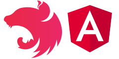

# NgNest backend
Use NestJS with Angular : backend part.
Discover how to use NestJS and Angular to build a basic CRUD app. 

  

This repository contains the backend part. It uses NestJS and a basic JSON collection stored into a basic file.

Feel free to clone, improve. Have fun !